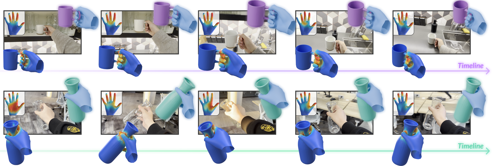
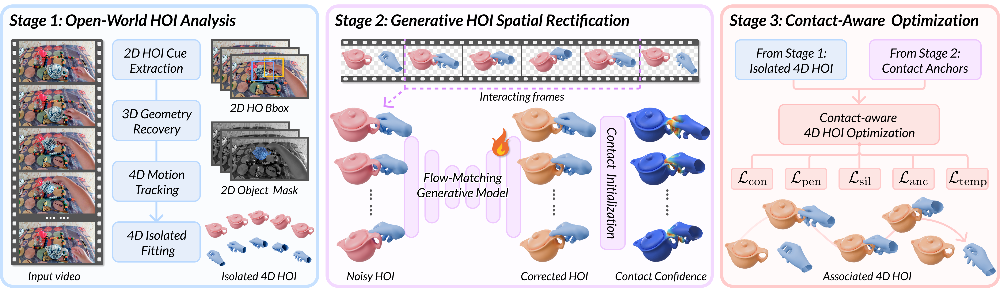

<h1 align="center">Open-CHOIR: Open-World Contact-Aware 4D Hand–Object Interaction Reconstruction</h1>

<h4 align="center">
  Hao Xu<sup>1</sup>, Yilin Liu<sup>2</sup>, Yinqiao Wang<sup>1</sup>,
  Chi-Wing Fu<sup>1</sup>, Niloy J. Mitra<sup>2,3</sup>
</h4>

<p align="center">
  <sup>1</sup>The Chinese University of Hong Kong &nbsp;&nbsp;
  <sup>2</sup>University College London &nbsp;&nbsp;
  <sup>3</sup>Adobe Research
</p>

<p align="center">
  <a href="https://hxwork.github.io/collections/2026_CHOIR/index.html"><strong>Project Page</strong></a>
  &nbsp; | &nbsp;
  <a href="https://arxiv.org/abs/2605.20992"><strong>Paper</strong></a>
</p>

<p align="center">
  
</p>

This is the official implementation of
[Open-CHOIR: Open-World Contact-Aware 4D Hand–Object Interaction Reconstruction](https://arxiv.org/abs/2605.20992).
The paper is conditionally accepted to ACM Transactions on Graphics
(SIGGRAPH Asia 2026 Journal Track).

CHOIR reconstructs 4D hand-object interaction (HOI) from a monocular RGB
video, including hand motion, object geometry, object pose trajectory, and a
physically plausible interaction sequence.

This release is organized as a three-stage pipeline:

1. Stage 1 prepares masks, object geometry, camera information, and MANO hand
   motion.
2. Stage 2 applies grasp-aware hand depth correction.
3. Stage 3 performs temporal hand-object fitting and writes the final HOI mesh
   sequence.

<p align="center">
  
</p>

The primary supported setting is **single hand + single object**. The release
also documents extensions for **two hands + one object** and **two hands + two
objects**.

## Tested Setup

The release has been tested on:

- NVIDIA A800
- NVIDIA RTX 4090D

The main environment is named `choir`. Pinned package versions are listed in
`requirements-choir.txt`. Adjust CUDA-specific wheels if your toolkit differs.

`stage1_preprocess/Dyn_HaMR_new` is the only stage that does **not** use the
main `choir` environment. Follow the original Dyn-HaMR setup for its
`dynhamr` environment, and set `CHOIR_VIPE_ENV` to the separate VIPE
environment before running Dyn-HaMR.

## Environment Setup

### Main `choir` Environment

Use Python 3.10 with CUDA 12.6 and PyTorch 2.6.0. Install the pinned
dependencies from `requirements-choir.txt`:

```bash
conda create -n choir python=3.10 -y
conda activate choir

# Install the pinned PyTorch stack + Python dependencies.
pip install -r requirements-choir.txt

# Editable project packages.
pip install -e stage2_grasp_correction/GraspFlowMatching/manotorch
pip install -e stage1_preprocess/sam-3d-objects/MoGe
```

Several geometry / CUDA packages need wheels that match PyTorch 2.6 + CUDA
12.6:

```bash
pip install torch-scatter -f https://data.pyg.org/whl/torch-2.6.0+cu126.html
pip install /path/to/pytorch3d-0.7.8+pt2.6.0cu126-*.whl
pip install /path/to/kaolin-0.18.0-*.whl
pip install /path/to/flash_attn-2.7.1.post1+cu12torch2.6-*.whl
```

### Dyn-HaMR and VIPE Environments

Dyn-HaMR is run in a separate environment:

```bash
conda activate /path/to/env/dynhamr
```

VIPE is called from inside the Dyn-HaMR stage through `CHOIR_VIPE_ENV`:

```bash
export CHOIR_VIPE_ENV=/path/to/env/vipe
```

Set up both environments following the original Dyn-HaMR repository and VIPE
instructions. CHOIR only assumes that `run_mano_sequence.py` can activate the
VIPE environment and run `vipe infer`.

## Repository Layout

```text
CHOIR/
├── data/                         # input videos
├── output/                       # per-video pipeline outputs
├── metrics/                      # evaluation summaries
├── output_layout.py              # canonical per-video path helper
├── stage1_preprocess/
│   ├── Yolov8/                   # hand/object detection + SAM2 masks
│   ├── sam-3d-objects/           # object geometry and single-frame pose init
│   └── Dyn_HaMR_new/             # MANO pose sequence reconstruction
├── stage2_grasp_correction/
│   ├── DexGraspNet_table/        # grasp training data generation
│   └── GraspFlowMatching/        # hand depth-offset correction
└── stage3_temporal_optimization/
    └── diffusion-vas/            # tracking, fitting, GFM interleave, final HOI
```

## Data Layout

Raw videos live in `data/`:

```text
data/<VIDEO_ID>.mp4
```

All intermediate and final outputs live under:

```text
output/<VIDEO_ID>/
```

Canonical per-video layout (defined in `output_layout.py`; only the new layout
is supported):

```text
output/<VIDEO_ID>/
├── inputs/
│   ├── video.mp4
│   ├── annotations/              # e.g. first_mask.png
│   ├── frames/rgb/
│   ├── masks/{object,hand_left,hand_right}/
│   ├── bbox/
│   ├── keypoints/
│   ├── intrinsics.json           # sibling of video.mp4 for VIPE/Dyn-HaMR
│   └── camera/global_bbox.json
├── stage1/
│   ├── object_init/{glb_0.glb,transform_0.json,rendered_on_image.png}
│   ├── depth/env_depths/
│   ├── hand/{mano_params,hand_meshes}/
│   ├── visualizations/
│   └── dynhamr/                  # Dyn-HaMR reconstruction outputs
├── stage2/
│   └── grasp_correction/
└── stage3/
    ├── intermediates/
    │   ├── amodal_masks/
    │   ├── cropped_depths/
    │   ├── cropped_metric_depths/
    │   ├── optimized_hoi_seq/          # sparse GFM export (intermediate)
    │   └── optimized_object_meshes/
    ├── final/
    │   ├── optimized_hoi_contact_seq/  # final MANO + object pose/geometry params
    │   ├── optimized_meshes/{hand,object}/
    │   └── optimized_transform_sequence.json
    ├── logs/
    ├── diagnostics/
    └── previews/
        ├── videos/
        ├── images/
        ├── meshes/
        └── visualization_3d.html
```

Stage ownership:

| Module | Writes |
| --- | --- |
| `Yolov8` | `inputs/` and `stage1/visualizations/` |
| `sam-3d-objects` | `stage1/object_init/`, `inputs/intrinsics.json`, `stage1/depth/env_depths/` |
| `Dyn_HaMR_new` | `stage1/dynhamr/`, `stage1/hand/{mano_params,hand_meshes}/` |
| `GraspFlowMatching` | `stage2/grasp_correction/camera_ray_depth_offset.json` |
| `diffusion-vas` | `stage3/`; metrics under `metrics/in_the_wild/` |

## Demo Data Download

The demo videos and seed annotations are distributed as a GitHub Release asset.
Download and extract it at the repository root:

```bash
REPO=/path/to/CHOIR
cd "$REPO"

curl -L -o choir_demo_data.zip \
  https://github.com/hxwork/CHOIR/releases/download/demo-data-v1/choir_demo_data.zip
unzip -o choir_demo_data.zip
rm choir_demo_data.zip
```

This creates:

```text
data/<VIDEO_ID>.mp4
output/<VIDEO_ID>/inputs/annotations/
  first_mask.png
  first_mask_overlay.jpg
  frame_000000.jpg
  prompt.json
```

The release includes 102 demo videos (72 numeric IDs and 30 `IMG_*` IDs).
`first_mask.png` is the Stage 1 object-mask seed used by the Quick Start
pipeline. Intermediate Stage 1/2/3 results are intentionally not included.

The released demo videos come from two sources:

1. Videos sampled from the TasteRob dataset. These samples are redistributed
   for CHOIR demo and reproducibility purposes and remain subject to the
   TasteRob dataset license and usage terms.
2. In-house captured videos collected by the CHOIR authors for this release.

By using the released demo data, users must comply with the CHOIR license and
the applicable terms of the original data sources, including TasteRob.

To rebuild the same zip from an existing checkout:

```bash
bash tools/pack_demo_data.sh
```

## Checkpoints and Assets

Model checkpoints and licensed assets are distributed outside the source tree.
Use the scripts below to install CHOIR release weights and fetch third-party
assets into the paths expected by the pipeline.

```bash
REPO=/path/to/CHOIR
cd "$REPO"

curl -L -o choir_release_assets.zip \
  https://github.com/hxwork/CHOIR/releases/download/demo-data-v1/choir_release_assets.zip
bash tools/install_choir_assets.sh "$REPO/choir_release_assets.zip"
rm choir_release_assets.zip

bash tools/download_external_assets.sh
python tools/check_assets.py
```

`choir_release_assets.zip` contains the CHOIR release weights:

```text
stage1_preprocess/Yolov8/models/tasterob_hoi_detector.pt
stage2_grasp_correction/GraspFlowMatching/results/050-Linear-velocity-None/checkpoints/0040000.pt
```

All other assets below are third-party or license-controlled. Keep their
original licenses with the files and do not redistribute MANO or gated assets
unless their licenses explicitly allow it.

### Public Downloads

`tools/download_external_assets.sh` downloads or prepares these third-party
assets:

- WiLoR detector from `https://huggingface.co/spaces/rolpotamias/WiLoR/resolve/main/pretrained_models/detector.pt`:
  `stage1_preprocess/Yolov8/models/wilor_hand_detector.pt` and
  `stage1_preprocess/Dyn_HaMR_new/third-party/hamer/pretrained_models/detector.pt`.
- SAM2.1 Hiera-L from `https://dl.fbaipublicfiles.com/segment_anything_2/092824/sam2.1_hiera_large.pt`:
  `stage1_preprocess/Yolov8/sam2/checkpoints/sam2.1_hiera_large.pt`.
- Dyn-HaMR/HaMeR upstream assets via `stage1_preprocess/Dyn_HaMR_new/scripts/prepare.sh`:
  `stage1_preprocess/Dyn_HaMR_new/_DATA/hamer_ckpts/checkpoints/hamer.ckpt`,
  `stage1_preprocess/Dyn_HaMR_new/_DATA/vitpose_ckpts/vitpose+_huge/wholebody.pth`,
  `stage1_preprocess/Dyn_HaMR_new/_DATA/data/mano_mean_params.npz`,
  `stage1_preprocess/Dyn_HaMR_new/_DATA/hmp_model/`, and
  `stage1_preprocess/Dyn_HaMR_new/_DATA/droid.pth`.
- Diffusion-VAS amodal segmentation checkpoint from
  `https://huggingface.co/kaihuac/diffusion-vas-amodal-segmentation`:
  `stage3_temporal_optimization/diffusion-vas/checkpoints/diffusion-vas-amodal-segmentation/`.
- Depth Anything V2 ViT-L from
  `https://huggingface.co/depth-anything/Depth-Anything-V2-Large/resolve/main/depth_anything_v2_vitl.pth`:
  `stage3_temporal_optimization/diffusion-vas/checkpoints/depth_anything_v2_vitl.pth`.
- Depth Anything V2 Metric Hypersim ViT-L, used by metric-depth variants, from
  `https://huggingface.co/depth-anything/Depth-Anything-V2-Metric-Hypersim-Large/resolve/main/depth_anything_v2_metric_hypersim_vitl.pth`:
  `stage3_temporal_optimization/diffusion-vas/checkpoints/depth_anything_v2_metric_hypersim_vitl.pth`.
- CoTracker3 scaled offline checkpoint from
  `https://huggingface.co/facebook/cotracker3/resolve/main/scaled_offline.pth`:
  `stage3_temporal_optimization/diffusion-vas/checkpoints/scaled_offline.pth`.
- MoGe-2 ViT-L normal checkpoint from `https://huggingface.co/Ruicheng/moge-2-vitl-normal`:
  `stage3_temporal_optimization/diffusion-vas/checkpoints/moge-v2-vitl-normal/model.pt`.
- SAM-3D Objects checkpoints from `https://huggingface.co/facebook/sam-3d-objects`:
  `stage1_preprocess/sam-3d-objects/checkpoints/hf/pipeline.yaml` and sibling checkpoint files.
  This repository is gated; request access and run `hf auth login` before retrying the script.

VIPE can create additional cache files on first run depending on the configured
priors. The script creates these cache directories:

```text
stage1_preprocess/Dyn_HaMR_new/third-party/vipe/checkpoints/
stage1_preprocess/Dyn_HaMR_new/third-party/vipe/torch_cache/
stage1_preprocess/Dyn_HaMR_new/third-party/vipe/hf_cache/
```

### Manual Assets

Some assets require license acceptance or generation and are intentionally not
downloaded automatically:

- MANO: register at `https://mano.is.tue.mpg.de/` and place `MANO_RIGHT.pkl` at:
  `stage1_preprocess/Dyn_HaMR_new/_DATA/data/mano/MANO_RIGHT.pkl`,
  `stage2_grasp_correction/DexGraspNet_table/grasp_generation/mano/MANO_RIGHT.pkl`,
  and `stage2_grasp_correction/DexGraspNet_table/grasp_generation/mano/models/MANO_RIGHT.pkl`.
- DexGraspNet/manotorch hand assets:
  `stage2_grasp_correction/DexGraspNet_table/grasp_generation/mano/contact_indices.json`
  and `stage2_grasp_correction/DexGraspNet_table/grasp_generation/mano/pose_distrib.pt`.
- BMC biomechanical constraint arrays from Hand-BMC-pytorch:
  `stage1_preprocess/Dyn_HaMR_new/_DATA/BMC/bone_len_max.npy`,
  `bone_len_min.npy`, `CONVEX_HULLS.npy`, `curvatures_max.npy`,
  `curvatures_min.npy`, `joint_angles.npy`, `PHI_max.npy`, and `PHI_min.npy`.

### Asset Validation

Run the validator after installing assets:

```bash
python tools/check_assets.py
```

To inspect every expected path:

```bash
python tools/check_assets.py --list
```

Environment overrides:

```bash
export CHOIR_SAM2_CHECKPOINT=/path/to/sam2.1_hiera_large.pt
export CHOIR_MOGE_CHECKPOINT=/path/to/model.pt
```

`--model_path_depth` should be the parent checkpoint directory; Stage 3 loads
`depth_anything_v2_{vitl|vitb|vits}.pth` from it.

## Quick Start: Single Hand + Single Object

Set variables:

```bash
REPO=/path/to/CHOIR
VID=<VIDEO_ID>
GPU=0
CHOIR_ENV=choir
DYNHAMR_ENV=/path/to/env/dynhamr
VIPE_ENV=/path/to/env/vipe
```

Input video:

```text
data/<VIDEO_ID>.mp4
```

### 0. First-frame Object Mask

If `output/<VIDEO_ID>/inputs/annotations/first_mask.png` is missing:

```bash
conda activate "$CHOIR_ENV"
cd "$REPO/stage1_preprocess/Yolov8"

python labeling.py \
  --data "$REPO/data" \
  --output "$REPO/output" \
  --video-id "$VID"
```

### 1. Stage 1: Detection and Mask Propagation

```bash
conda activate "$CHOIR_ENV"
cd "$REPO/stage1_preprocess/Yolov8"

CUDA_VISIBLE_DEVICES=$GPU python run_with_manual_object_mask.py \
  --video_id "$VID" \
  --data_dir "$REPO/data" \
  --output_dir "$REPO/output" \
  --num_workers 1
```

Check:

```bash
test -d "$REPO/output/$VID/inputs/frames/rgb"
test -d "$REPO/output/$VID/inputs/masks/object"
test -f "$REPO/output/$VID/inputs/video.mp4"
```

### 2. Stage 1: Object Geometry and Initial Pose

```bash
conda activate "$CHOIR_ENV"
cd "$REPO/stage1_preprocess/sam-3d-objects"

CUDA_VISIBLE_DEVICES=$GPU python run_reconstruction.py \
  --video_id "$VID" \
  --data_dir "$REPO/output" \
  --output_dir "$REPO/output"
```

Check:

```bash
test -d "$REPO/output/$VID/stage1/object_init"
test -f "$REPO/output/$VID/inputs/intrinsics.json"
test -d "$REPO/output/$VID/stage1/depth/env_depths"
```

### 3. Stage 1: MANO Sequence

```bash
conda activate "$DYNHAMR_ENV"
cd "$REPO/stage1_preprocess/Dyn_HaMR_new/dyn-hamr"

export CHOIR_VIPE_ENV="$VIPE_ENV"

CUDA_VISIBLE_DEVICES=$GPU python run_mano_sequence.py \
  --video_id "$VID" \
  --video_dir "$REPO/output" \
  --gpus "$GPU"
```

Check:

```bash
test -d "$REPO/output/$VID/stage1/dynhamr"
test -d "$REPO/output/$VID/stage1/hand/mano_params"
test -d "$REPO/output/$VID/stage1/hand/hand_meshes"
```

Batch logs are written next to `run_mano_sequence.py` as
`batch_test_results_<timestamp>.txt` and `batch_test_errors_<timestamp>.txt`.

### 4. Stage 3: Temporal Optimization

Stage 3 auto-runs the Stage 2 GraspFlowMatching pre-pass when
`camera_ray_depth_offset.json` is missing.

```bash
conda activate "$CHOIR_ENV"
cd "$REPO/stage3_temporal_optimization/diffusion-vas"

CUDA_VISIBLE_DEVICES=$GPU python run_temporal_optimization.py \
  --video_id "$VID" \
  --data_path "$REPO/output" \
  --data_output_path "$REPO/output"
```

Check:

```bash
test -f "$REPO/output/$VID/stage2/grasp_correction/camera_ray_depth_offset.json"
test -d "$REPO/output/$VID/stage3/final/optimized_meshes/hand"
test -d "$REPO/output/$VID/stage3/final/optimized_meshes/object"
test -f "$REPO/output/$VID/stage3/previews/videos/optimized_fitting.mp4"
```

Metrics:

```bash
bash run_in_the_wild_metrics.sh "$VID"
# writes "$REPO/metrics/in_the_wild/"
```

Optional HO3D / MagicHOI evaluation export:

CHOIR's built-in evaluation path is the in-the-wild metric command above. For
HO3D benchmark experiments, Stage 3 can additionally export an `eval_data.npy`
file compatible with the MagicHOI/HOLD-style metric inputs:

```bash
CUDA_VISIBLE_DEVICES=$GPU python run_temporal_optimization.py \
  --video_id "$VID" \
  --data_path "$REPO/output" \
  --data_output_path "$REPO/output" \
  --export_ho3d_eval_data
```

The exported file is written to:

```text
output/<VIDEO_ID>/stage3/final/ho3d_eval/eval_data.npy
```

It contains the predicted hand/object vertices, faces, MANO-order hand joints,
root-relative hand joints, camera intrinsics, and object vertices in the layout
expected by MagicHOI-style HO3D metrics. The HO3D benchmark data preparation,
environment setup, and metric computation code are not maintained in CHOIR; use
the official [MagicHOI](https://github.com/byran-wang/MagicHOI) repository for
that evaluation setup.

## Extensions

### Two Hands + One Object

Stage 3 fits one hand at a time. For a video with both hands interacting with
one object, prepare dual-hand Stage 1 inputs (`left`/`right` MANO params,
masks, bbox, and keypoints), run Stage 3 twice, then merge the mesh sequences:

```bash
cd "$REPO/stage3_temporal_optimization/diffusion-vas"
conda activate "$CHOIR_ENV"

CUDA_VISIBLE_DEVICES=$GPU python run_temporal_optimization.py \
  --video_id <VIDEO_ID_LEFT> \
  --hand_side left \
  --data_path "$REPO/output" \
  --data_output_path "$REPO/output"

CUDA_VISIBLE_DEVICES=$GPU python run_temporal_optimization.py \
  --video_id <VIDEO_ID_RIGHT> \
  --hand_side right \
  --data_path "$REPO/output" \
  --data_output_path "$REPO/output"

python convert_hoi_for_two_hand_one_obj.py \
  --left_seq "$REPO/output/<VIDEO_ID_LEFT>/stage3/final/optimized_meshes" \
  --right_seq "$REPO/output/<VIDEO_ID_RIGHT>/stage3/final/optimized_meshes" \
  --output_seq "$REPO/output/<VIDEO_ID_MERGED>/stage3/final/optimized_meshes"
```

`<VIDEO_ID_LEFT>` and `<VIDEO_ID_RIGHT>` can be two copies of the same clip, or
separate output trees that select different `--hand_side` inputs. The merge
script aligns the right run to the left using the shared object mesh and writes
`left_hand/`, `right_hand/`, combined `hand/`, `object/`, and `metadata.json`.

### Two Hands + Two Objects

For two independent hand-object interactions in the same video, run two
single-hand/single-object reconstructions:

1. left hand + object A,
2. right hand + object B.

Keep the two `stage3/final/optimized_meshes/` trees as two separate interaction
results, or collect them under a merged output directory for downstream
visualization. This case does not use `convert_hoi_for_two_hand_one_obj.py`
because the objects are different and should not be aligned through a shared
object mesh.

## Batch: Single Hand + Single Object

```bash
REPO=/path/to/CHOIR
GPU=0
CHOIR_ENV=choir
DYNHAMR_ENV=/path/to/env/dynhamr
VIPE_ENV=/path/to/env/vipe
VIDEO_IDS=(107407 107408 107409)
```

### Stage 1: Detection and Masks

```bash
conda activate "$CHOIR_ENV"
cd "$REPO/stage1_preprocess/Yolov8"

CUDA_VISIBLE_DEVICES=$GPU python run_with_manual_object_mask.py \
  --video_id "${VIDEO_IDS[@]}" \
  --data_dir "$REPO/data" \
  --output_dir "$REPO/output" \
  --num_workers 1
```

### Stage 1: Object Geometry

```bash
conda activate "$CHOIR_ENV"
cd "$REPO/stage1_preprocess/sam-3d-objects"

CUDA_VISIBLE_DEVICES=$GPU python run_reconstruction.py \
  --video_id "${VIDEO_IDS[@]}" \
  --data_dir "$REPO/output" \
  --output_dir "$REPO/output"
```

### Stage 1: MANO Sequence

```bash
conda activate "$DYNHAMR_ENV"
cd "$REPO/stage1_preprocess/Dyn_HaMR_new/dyn-hamr"

export CHOIR_VIPE_ENV="$VIPE_ENV"

CUDA_VISIBLE_DEVICES=$GPU python run_mano_sequence.py \
  --video_id "${VIDEO_IDS[@]}" \
  --video_dir "$REPO/output" \
  --gpus "$GPU"
```

### Stage 3: Temporal Optimization

Use `--total_parts` and `--part_idx` for multi-machine sharding.

```bash
conda activate "$CHOIR_ENV"
cd "$REPO/stage3_temporal_optimization/diffusion-vas"

CUDA_VISIBLE_DEVICES=$GPU python run_temporal_optimization.py \
  --video_id "${VIDEO_IDS[@]}" \
  --data_path "$REPO/output" \
  --data_output_path "$REPO/output"
```

Sharding:

```bash
CUDA_VISIBLE_DEVICES=$GPU python run_temporal_optimization.py \
  --video_id "${VIDEO_IDS[@]}" \
  --data_path "$REPO/output" \
  --data_output_path "$REPO/output" \
  --total_parts 4 \
  --part_idx 0
```

Metrics:

```bash
bash run_in_the_wild_metrics.sh "${VIDEO_IDS[@]}"
```

For HO3D benchmark runs, pass `--export_ho3d_eval_data` to the Stage 3 command
to write `stage3/final/ho3d_eval/eval_data.npy`. Leave it off for normal
in-the-wild videos.

## Training GraspFlowMatching (Optional)

The release includes the data-preparation path used to retrain the Stage 2
GraspFlowMatching model. This is optional for inference: the release checkpoint
above is sufficient for the reconstruction pipeline.

### Training Data Layout

Grasp training data is read from:

```text
stage2_grasp_correction/DexGraspNet_table/meshdata/
└── dexgraspnet/<OBJECT_ID>/decomposed.obj
```

Training grasps are generated only from DexGraspNet object meshes. Download
DexGraspNet assets from the official source under its license and place each
mesh at the layout above. Each object directory starts with `decomposed.obj`;
the steps below generate `init_obj_poses.npy`, point samples, and `grasp_data/`.

### Generate Object Poses and Grasp Candidates

```bash
REPO=/path/to/CHOIR
GPU=0
OBJECT_ID=<OBJECT_ID>

conda activate choir
cd "$REPO/stage2_grasp_correction/DexGraspNet_table"

# Generate initial tabletop object poses for meshdata/dexgraspnet/<OBJECT_ID>/.
python grasp_generation/scripts/generate_object_pose_mine.py \
  --data_root_path "$PWD/meshdata" \
  --object_code_list "$OBJECT_ID" \
  --n_samples 1000 \
  --n_cpu 16

# Optional: export FPS point samples used by downstream data loaders.
CUDA_VISIBLE_DEVICES=$GPU python prepare_meshdata.py \
  --data_root "$PWD/meshdata" \
  --video_id "$OBJECT_ID" \
  --skip_prepare

# Generate grasp candidates and per-grasp JSON files.
CUDA_VISIBLE_DEVICES=$GPU python grasp_generation/main_prep_data.py \
  --data_root "$PWD/meshdata" \
  --object_code_list "$OBJECT_ID" \
  --name retrain

# Optional: run the PyBullet stability filter on generated grasps.
python grasp_generation/validate_grasping_pose.py \
  --object_dir "$PWD/meshdata/dexgraspnet/$OBJECT_ID" \
  --batch
```

`generate_object_pose_mine.py` and `main_prep_data.py` use CHOIR's
`meshdata/dexgraspnet/<OBJECT_ID>/` layout directly; the original DexGraspNet
training entrypoints are not required for this path.

### Train the GraspFlowMatching Model

`GraspFlowMatching/data_loader/GraspPair.py` reads generated grasps from
`stage2_grasp_correction/DexGraspNet_table/meshdata/dexgraspnet/*/grasp_data/*.json`.
After preparing the training set, launch training from the GraspFlowMatching
directory:

```bash
REPO=/path/to/CHOIR
N_GPUS=8

conda activate choir
cd "$REPO/stage2_grasp_correction/GraspFlowMatching"

torchrun --standalone --nproc_per_node=$N_GPUS train_cam_ray.py \
  --results_dir results \
  --global_batch_size 512
```

Checkpoints are written under `stage2_grasp_correction/GraspFlowMatching/results/`.
The released model used by the default pipeline is:

```text
stage2_grasp_correction/GraspFlowMatching/results/050-Linear-velocity-None/checkpoints/0040000.pt
```

You can replace that checkpoint with a retrained model, or pass `--ckpt` to
`train_cam_ray.py` when resuming from a checkpoint.

## Acknowledgements

CHOIR builds on and references many excellent open-source projects and assets,
including Dyn-HaMR, HaMeR, VIPE, DROID-SLAM, SAM2, Ultralytics/YOLO,
WiLoR/TasteRob detector assets, sam-3d-objects/SAM3D, Depth Anything V2, MoGe,
CoTracker, diffusion-vas, DexGraspNet, GraspFlowMatching, MANO/manotorch,
PyTorch3D, ViTPose, and related hand-pose / geometry dependencies.

Please follow the licenses and usage terms of all upstream projects, pretrained
weights, datasets, and MANO assets.

## Citation

If you use this code, please cite:

```bibtex
@article{xu2026choir,
  title   = {Open-CHOIR: Open-World Contact-Aware 4D Hand–Object Interaction Reconstruction},
  author  = {Xu, Hao and Liu, Yilin and Wang, Yinqiao and Fu, Chi-Wing and Mitra, Niloy J.},
  journal = {ACM Transactions on Graphics (SIGGRAPH Asia Journal Track)},
  year    = {2026},
  note    = {Conditionally accepted}
}
```

## License

CHOIR-authored code is released under the MIT License. See `LICENSE`.

Vendored third-party code, checkpoints, model weights, datasets, and MANO
assets are covered by their respective licenses and usage terms. See
`THIRD_PARTY_NOTICES.md` and the license files in each third-party directory.
